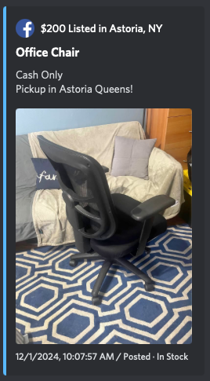
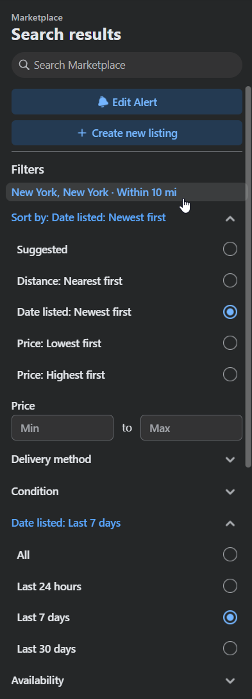

# FB Marketplace Discord Webhook Pusher



A facebook userscript that checks FB Marketplace intervally and pushes onto a discord webhook!

## Requirements

- Chrome Browser
- Violent Monkey Extension
- Facebook Account

## Steps to Run

1. Open Chrome
2. Navigate to [facebook](https://facebook.com) and log in with your personal account
3. Install the two Userscripts onto violentmonkey
4. Adjust the excluded keywords in facebook item spawner.js
```js
excluded = ['free','ship'] 
```
4. Adjust the webhook in item pusher.js
```js
discordwebhookurl = "YOUR URL HERE"
```
5. Enable the userscripts
6. Navigate to facebook marketplace and search item of your choosing
7. Adjust the location of your choosing, pick sort by new and listed within 7 days for best results
